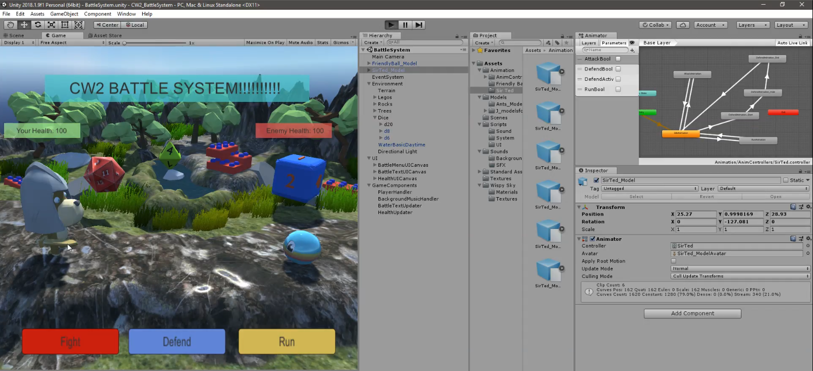
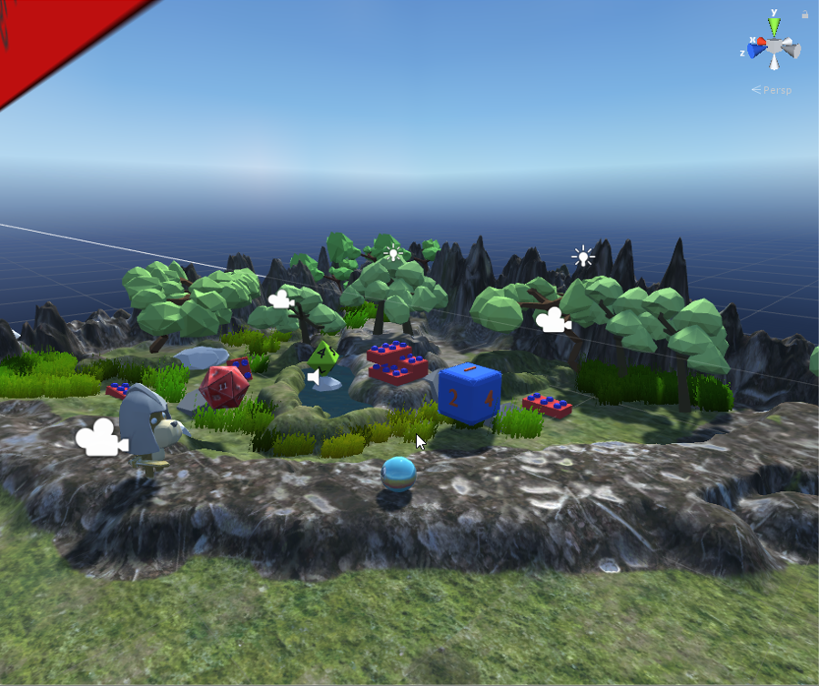
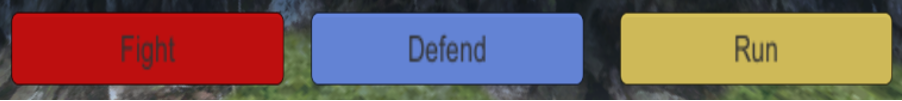

# A Turn Based Battle System

This Turn Based Battle System was based on inspirations from classic Japanese Roleplaying games such as Final Fantasy.

This project was developed with a collegue as part of my university degree in both employing production and programming skills in order to build a fully usable scene with the intended features similar to a traditional turn based battle system.

This project was developed with Unity, C#, Blender, Maya and Photoshop.

## Sample Screenshots

